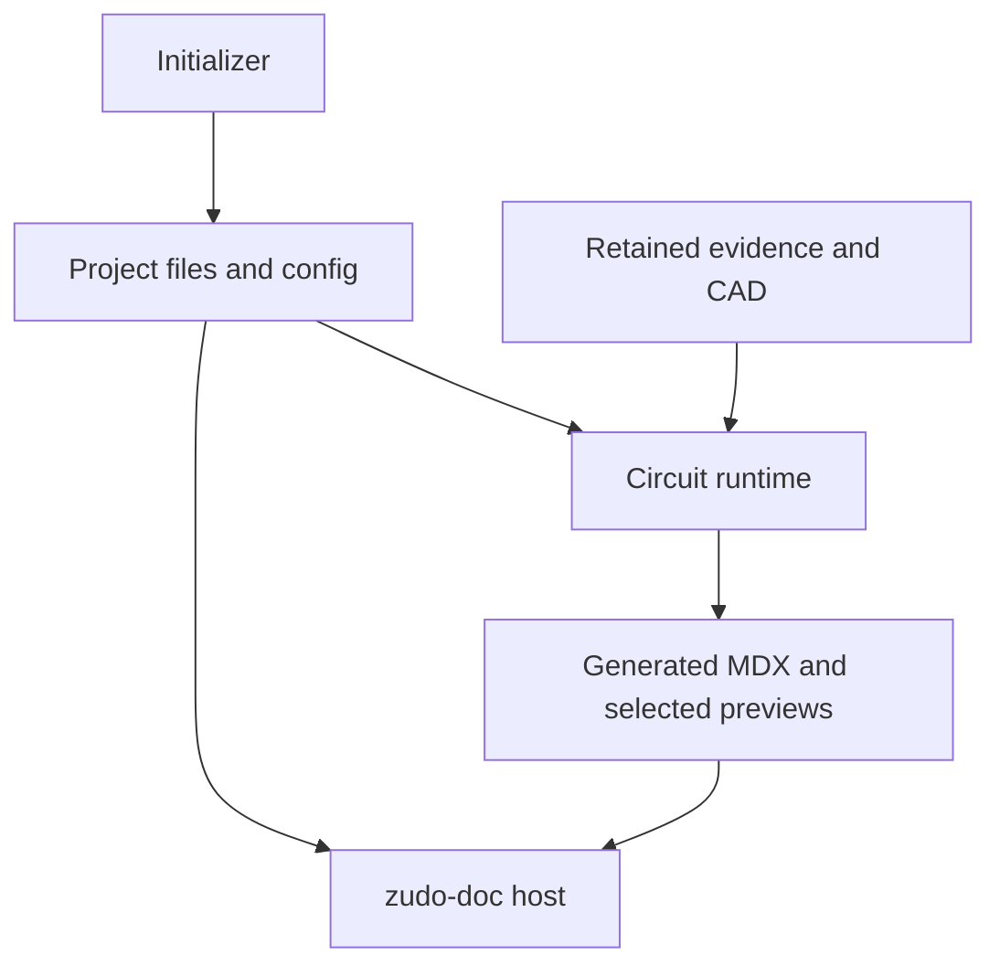

# Architecture and extraction

## The proposed package boundary

Use one monorepo with two publishable packages, following the inspected zudo-sg arrangement:

| Proposed location | Responsibility |
| --- | --- |
| `packages/create-zudo-circuit-doc/` | Initializer CLI, project-name/path checks, template composition, package metadata and install options |
| `packages/circuit-doc/` | `@takazudo/zudo-circuit-doc`: reusable validation integration, evidence projection, renderer/UI, preview tooling, package CLI and config |
| `doc/` | Documentation of zudo-circuit-doc itself, powered by zudo-doc |
| `examples/empty/` | Actual generated empty project fixture |
| `examples/minimal/` | Small circuit fixture independent of the lamp |
| `fixtures/led/` | Pinned regression corpus or reproducible fixture loader |

Package names and public exports are proposed. Confirm namespace access and package availability locally before release.

zudo-sg separates `packages/create-zudo-sg` from `packages/styleguide`. Its host composes `withZudoSg(zudoDoc(...), zudoSgConfig)`; its shared UI/routes live with the runtime. The circuit equivalent should follow that ownership model, but a function named `withZudoCircuitDoc` does not exist in the inspected repositories. [zudo-sg config](https://github.com/Takazudo/zudo-sg/blob/b9b36ce35d98d6abc641d84e8535552eac0dbded/packages/create-zudo-sg/templates/default/zfb.config.ts).

## Dependency direction

Acquisition tools update retained evidence. The documentation build reads it. A web request or site build must not initiate datasheet research, silently refresh hashes or alter a circuit.

## Preserve the LED core/adapter seam

The LED adoption guide already describes the correct extraction boundary. The core is neutral about **where electronic-component evidence comes from**. Its model deliberately includes MPN, manufacturer, LCSC, package, DNP, board and reference designator. It is not a general-purpose domain-agnostic documentation engine; circuit development is exactly the appropriate domain. [Adoption guide](https://github.com/Takazudo/zudo-led-lamp/blob/194d8a297e3545588197342130c3111a66c10973/doc/src/content/docs/how-to/component-docs-adoption.mdx).

Actual `ComponentDataAdapter` fields include:

- `id`, `contractVersion`, `supportedViewModelVersions`;
- a `validate` callback returning command/exit/output information;
- committed `selection` and `matrix`;
- a `project(context)` function producing the public view model.

Keep the canonical validation callback. Do not implement a second weaker validator in the TypeScript renderer. [Adapter interface](https://github.com/Takazudo/zudo-led-lamp/blob/194d8a297e3545588197342130c3111a66c10973/doc/component-docs/core/adapter.ts).

## Extraction map

| LED source | Destination / treatment |
| --- | --- |
| `doc/component-docs/core/` | Move into runtime package with its contracts and focused tests |
| `doc/component-docs/adapters/circuit/` | Refactor into config-driven v1 evidence provider |
| `doc/component-docs/ui/` | Package MDX components and exports |
| `doc/src/component-model-viewer/` | Package optional WRL preview runtime/browser island |
| `doc/src/component-preview/` | Package footprint preview interaction |
| `doc/component-docs/footprint-previews/` | Package tool with project-owned selections and explicit renderer/tool configuration |
| `doc/component-docs/cli/` | Package commands with explicit project-root/config resolution |
| `component-spec-audit/references/contract.md` and `schema.json` | Preserve v1 semantics; note schema.json is a custom contract, not standard JSON Schema |
| `component-spec-audit/scripts/validate.py` | Separate generic validation from project inventory providers and corpus fixtures |
| Component evidence bundles | Project-owned data; keep original v1 files/IDs |
| `circuit-spec-integration` | Generic interaction contract plus project-owned rules |
| `doc/src/content/docs/architecture/`, `research/`, `power/` | Mine authoring patterns; do not seed lamp decisions as defaults |
| `scripts/schgen/`, `scripts/pcb/`, `enclosure/` | LED example or later optional provider, outside default scaffold |
| `manufacturing/` | Example of source-tied export records; no prefilled manufacturing package |

See the reports in [research](../research/README.md) for file-level evidence and further dependencies. These rows describe relocation intent, not instructions to copy directories without resolving their imports and assets.

## Hard-coded behavior to remove

| Coupling | Why it breaks reuse | Required result |
| --- | --- | --- |
| Root resolved from the package source file's relative depth | Installed code lives under node_modules | Resolve consumer project root from explicit config/CLI location |
| Three concrete board generator files | Empty/manual/different projects have no such files | Inventory provider interface with explicit manual and generator-backed modes |
| Lamp library names and fixed board-depth model path | Different projects and directory depth | Configured project libraries and verified relative model paths |
| Selection sets and expected counts | New component requires editing runtime source | Project-owned committed selection, counts and update tooling |
| 25-package assertions in references/model planning | Zero or one model cannot build | Derive from reviewed selection; retain stale-selection validation |
| Fixture-specific required records and domains | New circuit fails before research | Generic validator plus optional project regression fixtures |
| Scanner minimums and positive control tied to AL8860 | Small sites cannot pass | Separate production scan policy from adversarial scanner self-tests |
| Lamp enclosure generation in normal build | New circuit has no lamp enclosure | Remove from default; optional project command |
| Absolute import/CSS/browser entry assumptions | Works in source repo but fails when packed | Pack-and-install consumer integration test |
| Target overwrite based only on generation marker during pruning | Hand-authored colliding target may be replaced | Preflight ownership of every existing output target before writing |

These are observed code/extraction concerns, not claims that the full upstream site has been experimentally proven broken. See [generator audit](../research/led-doc-engine.md) for targeted checks and the distinction between code inspection and execution.

## Evidence paths: compatibility first

Recommended first extraction: keep the LED v1 bundle layout in a generated project's `.claude/skills/`, make the path configurable, and use a neutral `circuit/WORKFLOW.md` as the shared agent entry point. Codex can read the same evidence files through its root instructions; do not duplicate the JSON into another tool directory.

This is a compatibility choice, not a requirement that the evidence system belong to Claude Code. A future `circuit/evidence/` profile can move those same bundles when the validator, routing and raw-resource links support it. Do not combine that storage migration with a schema rewrite.

Package-owned validation scripts should be located through installed package resources. Project bundles should contain their data and minimal entry instructions; they should not require copying an entire validator into every project forever. Test Python resource discovery from a packed consumer.

## zudo-doc integration

Keep zudo-doc's host responsibilities: MDX/content routing, search, navigation, history, asset viewer, image enlargement, LLM text outputs and the supported Claude/Codex publication integrations.

The LED implementation adds MDX evidence components through `chromeBindingsModule`. Its current doc route also statically imports the footprint and model preview islands so zfb discovers them. Packaging only the static bindings is incomplete. Preserve this host seam, or verify an upstream-supported replacement, using a real browser and a packed dependency. Older architecture prose is not sufficient authority when current source differs. [Host route](https://github.com/Takazudo/zudo-led-lamp/blob/194d8a297e3545588197342130c3111a66c10973/doc/pages/docs/%5B%5B...slug%5D%5D.tsx), [bindings](https://github.com/Takazudo/zudo-led-lamp/blob/194d8a297e3545588197342130c3111a66c10973/doc/src/chrome-bindings.tsx).

zudo-doc's general asset viewer and the LED circuit model viewer are separate capabilities. Do not claim that the asset viewer automatically renders STEP/STL. The retained circuit viewer uses selected WRL files; STEP remains a CAD interchange asset. [Model descriptor](https://github.com/Takazudo/zudo-led-lamp/blob/194d8a297e3545588197342130c3111a66c10973/doc/component-docs/core/model-descriptor.ts).

## Ownership and upgrades

| File type | Owner | Update behavior |
| --- | --- | --- |
| Narrative MDX, project decisions and bench results | User/project | Preserve edits |
| Exact-part evidence, source locks and inventory | Project | Explicit task-driven changes |
| Publication selections | Project | Reviewable update in the same task as record/catalog changes |
| Generated component MDX and previews | Generator | Replace only declared/marked owned outputs |
| Renderer, schema code and validator implementation | Package | Upgrade as dependency |
| Scaffold host glue | Shared maintenance | Track baseline and reconcile; never blanket-copy over extensions |
| Agent entry files | Project plus generated sections | Preserve unrelated instructions, one canonical workflow |

A later `doctor` command may diagnose versions, paths and missing tools. An automatic `update` should be deferred until it can show an ownership-aware diff and handle conflicts. Dependency updates must not silently rewrite retained engineering evidence.
